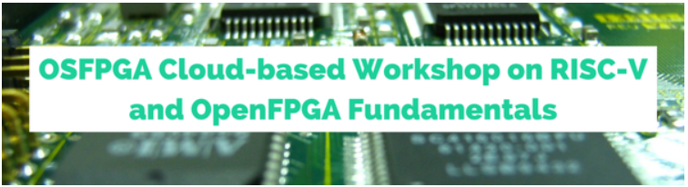
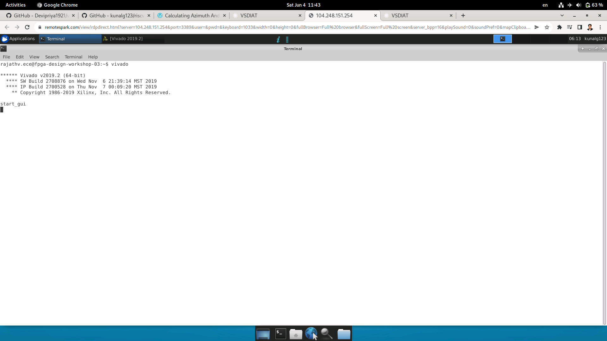

# FPGA - Fabric, Design and Architecture
FPGA - Fabric, Design and Architecture

### ABOUT THE WORKSHOP
The Workshop is a 5-day program designed for freshers as well as professionals who are interested in contributing to the VLSI industry. It is a cloud based workshop that comprises of training courses covering RISC-V specs, RISC-V software, Implementation of RISC-V basic specifications using TL-Verilog and Simulation of RISC-V core. 

#### 
### AGENDA
 [Day 1 ](#Day1)
  * [Part 1: FPGA introduction](#Part1-FPGA-introduction)
  * [Part 2: Vivado-counter](#Part2-Vivado-counter)
  * [Part 3: VIO Counter](#Part3-VIO-Counter)
 
 [Day 2 OpenFPGA2](#Day2-OpenFPGA)
  * [Part 1: OpenFPGA Intro](#Part1-OpenFPGA-Intro)
  * [Part 2: VPR](#Part2-VPR)
  * [Part 3: VTR](#Part3-VTR)

 [Day 3 Introduction to RISC-V core ](#Day3-Introduction-to-RISC-V-core)
  * [Part 1: RVMyth vivado rtl-to-synthesis](#Part1-RVMyth-vivado-rtl-to-synthesis)
  * [Part 2: RVMyth Vivado synthesis-to-bitstream](#Part2-RVMyth-Vivado-synthesis-to-bitstream)

 [Day 4 Introduction to SOFA IP](#Day4-Introduction-to-SOFA-IP)
  * [Part 1: SOFA counter area](#Part1-SOFA-counter-area)
  * [Part 2: Fetch, decode, and execute logic](#Part2-SOFA-counter-timing)
  * [Part 3: SOFA counter post impl](#Part3-SOFA-counter-post-impl)
  * [Part 4: SOFA counter power](#Part4-SOFA-counter-power)

 [Day 5 RISC-V core on custom SOFA fabric](#Day5-RISC-V-core-on-custom-SOFA-fabric)
  * [Part 1: SOFA-RVMyth run](#Part1-SOFA-RVMyth-run)
  * [Part 2: SOFA-RVMyth timing and area](#Part2-SOFA-RVMyth-timing-and-area)
  * [Part 3: RVMyth-post impl netlist](#Part3-RVMyth-post-impl-netlist)
  * [Part 4: SOFA-RVMyth Vivado simulation](#Part4-SOFA-RVMyth-Vivado-simulation)
  
## Day1-Intro
## FPGA introduction
The History of manufacturing programmable hardware goes back to the days of Programmable logic devices (PLDs) and Programmable logic arrays (PLAs)s where arrays of AND gates and OR gates were fabricated with fuses blown to make or break connections. Leter on, Complex programmable logic devices (CPLDs) arrived on the scene, finally making way for Field-Programmable Gate Arrays (FPGA). FPGA chips are customisable hardware which can be used for rapid prototyping and to study the effect of area, speed, power of the digital circuits.

A “field programmable” gate array is an Integrated circuit designed to be configured by a designer using HDL similar to an ASIC (Application Specific Integrated Circuit), but FPGAs use look-up tables (LUTs), Flip-flops and programmable interconnect and I/O blocks. ASICs (Application Specific Integrated Circuit) are designed from RTL to layout. Layout must be sent to semiconductor foundary for fabrication. ASICs, once fabricated, cannot be reprogrammed. FPGAs (Field Programmable Gate Array) are designed from RTL to bitstream. Design programmed on the FPGAs which are bought off-the-shelf. FPGAs can be re-programmed.

FPGA Architecture:
FPGAs consists of the following building blocks:
<ul>
 <li> Configurable logic blocks (CLBs): Implement combinatorial and sequential logic based on LUTs and Flip-flops or latches </li>
 <li> Carry and Control Logic: Implements arithmetic operations </li>
 <li> Flip Flops (FFs)/ Latches </li>
 <li> Memory Elements </li>
 <li> Programmable I/O blocks: Configurable I/Os for external interface connections </li>
 <li> Programmable interconnect: Wires to connect inputs, CLBs and outputs </li>
</ul>

## Vivado counter

## VIO Counter

Different ways of programming
● Local programing on the Basys3 board
● Remote programing
– Inputs through Virtual Input/Output and Outputs observed on the board
– Inputs through Virtual Input/Output and Outputs observed on the Integrated Logic Analyzer (ILA)

## Day OpenFPGA2
## Part 1: OpenFPGA Intro
OpenFPGA
● Current methodologies to produce an FPGA involve several hardware and software engineers and development for several months
● How do we improve the design/development times?
● OpenFPGA: Open source framework which can be used to quickly generate a fabric for a custom FPGA (specific to your design)
– Automation techniques used
– Reduces FPGA development cycle of a new FPGA to a few days
– Provides open source design tools
OpenFPGA
● Need for custom FPGAs?
– Accelerate domain-specific applications: FPGA architectures have to be custom made, to provide maximum computing. Prototyping and producing a custom FPGA is costly and time-consuming
● Customise your own FPGA fabric using a set of templates (> 20 FPGA architectures- in xml files optimised for different applications)
● Generates Verilog netlists describing an FPGA fabric based on an XMLbased description file: VPR’s (Versatile Place and Route) architecture description language
● Allows you to write your own FPGA fabric (for a specific application) using OpenFPGA’s architecture description language
● Automatically generates Verilog testbenches to validate the correctness of FPGA fabric
● Bitstream generation support based on the same XML-based description file 
Running the tool
● VTR:
– https://docs.verilogtorouting.org/en/latest/quickstart/
● Build OpenFPGA (done on cloud)
● Build VTR (done on cloud)
● Run VPR on a Pre-Synthesized Circuit
– Observe the result files
– Visualize (GUI) circuit implementation
● Run the entire VTR flow automatically
– Implement our own circuit (blink.v and counter.v) on a pre-existing
FPGA architecture Earch.xml (VTR_ROOT/vtr_flow/arch)
– Use an automated approach (Odin II and ABC are automatically run)
– Perform timing simulation on the generated fabric

## Part 2: VPR
Run VPR on a Pre-Synthesized Circuit
● Run VPR on a Pre-Synthesized Circuit
https://docs.verilogtorouting.org/en/latest/vpr/
– Packing (combines primitives into complex blocks)
– Placement (places complex blocks within the FPGA grid)
– Routing (determines interconnections between blocks)
– Analysis (analyzes the implementation)
● Input: Blif file, Earch
● Command:> $VTR_ROOT/vpr/vpr \
 $VTR_ROOT/vtr_flow/arch/timing/EArch.xml \
 $VTR_ROOT/vtr_flow/benchmarks/blif/tseng.blif \ --
route_chan_width 100
Run VPR on a Pre-Synthesized Circuit
● BLIF Netlist (.blif)
– https://docs.verilogtorouting.org/en/latest/vpr/file_formats/
– The technology mapped circuit to be implement
on the target FPGA is specified as a Berkely
Logic Interchange Format (BLIF) netlist.
– The netlist must be flattened and consist of only
primitives (e.g. .names, .latch, .subckt)
– Clock and delay constraints can be specified
with an SDC File.

## Part 3: VTR

## Day 3 Introduction to RISC-V core programming on Vivado
## Part 1: RVMyth vivado rtl-to-synthesis

## Part 2: RVMyth Vivado synthesis-to-bitstream

## Day 4 Introduction to SOFA FPGA Fabric IP
## Part1 SOFA counter area]

## Part2 SOFA counter timing]

## Part3 SOFA counter post impl

## Part4 counter power

## Day 5 RISC-V core on custom SOFA fabric
## Part1 SOFA-RVMyth run

## Part2 SOFA-RVMyth timing and area

## Part3 RVMyth-post impl netlist

## Part4 SOFA-RVMyth Vivado simulation

### ACKNOWLEDGMENTS
#### Mr. Kunal Ghosh
Co-founder of VLSI System Design (VSD) Corporation Private Limited
#### Mrs. Nanditha Rao
Course Instructor
#### Glenn Frey Olamit
Beautiful and detailed Github repository
